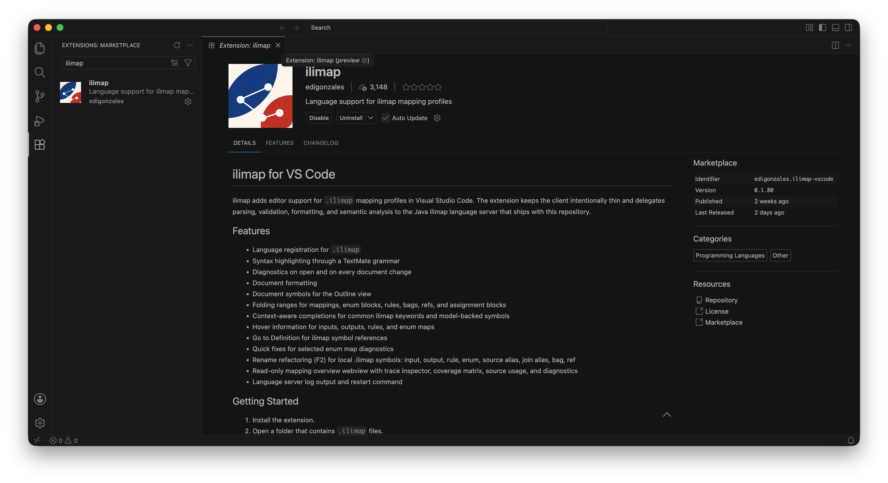
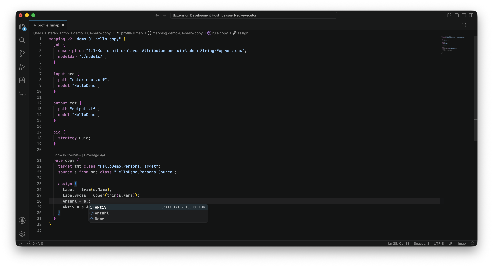
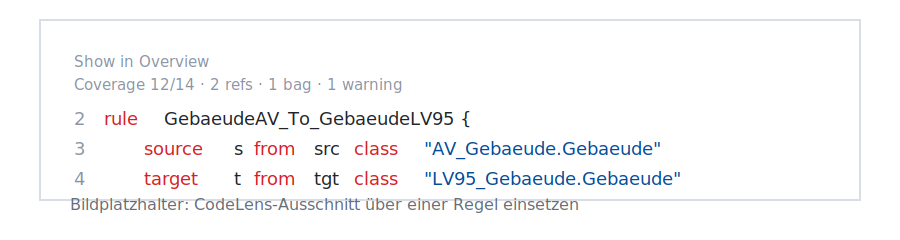
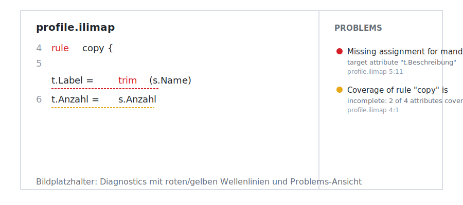
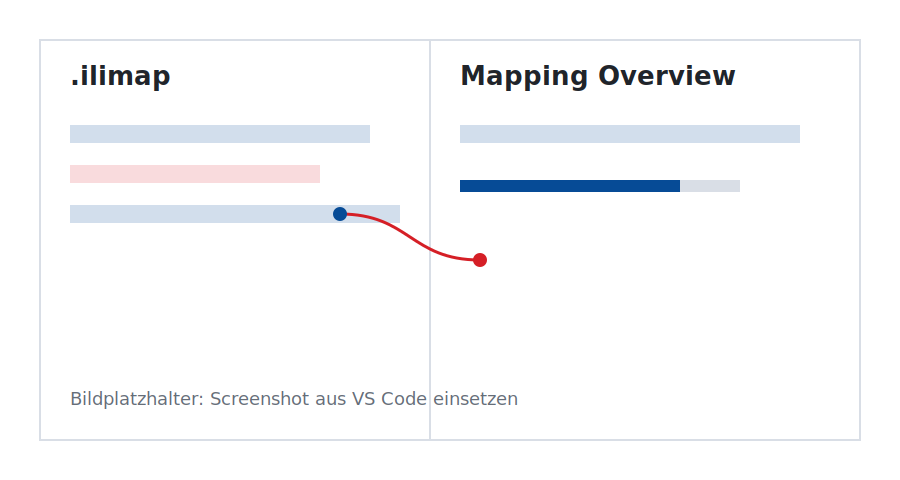
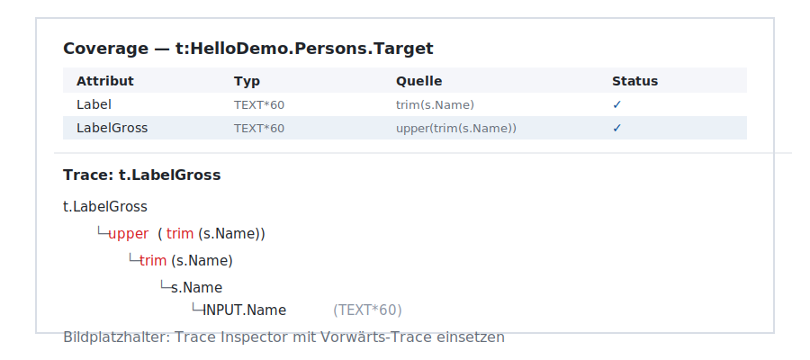

## Editor

Die `ilimap`-Erweiterung macht aus `.ilimap`-Dateien eine vollständig unterstützte Sprache in Ihrer Entwicklungsumgebung: mit farblicher Hervorhebung, automatischer Vervollständigung, Fehlerprüfung während des Schreibens und einer grafischen Mapping-Übersicht. Alles, was Sie dafür brauchen, ist VS Code, VSCodium oder Eclipse Theia.

### Installation

Die Erweiterung heisst **ilimap** (Publisher `edigonzales`) und ist in zwei Registries verfügbar:

- **Visual Studio Marketplace** — für [VS Code](https://code.visualstudio.com)
- **Open VSX** — für [VSCodium](https://vscodium.com) und [Eclipse Theia](https://theia-ide.org)

Beide enthalten dasselbe Paket mit dem gleichen Funktionsumfang. Öffnen Sie die Erweiterungssuche mit `Ctrl+Shift+X` (Windows/Linux) oder `Cmd+Shift+X` (Mac), suchen Sie nach `ilimap` und klicken Sie auf **Installieren**.



Die Erweiterung aktiviert sich automatisch, sobald Sie eine `.ilimap`-Datei öffnen.

### Funktionen im Überblick

| Funktion | Das tut sie | Beispiel |
|---|---|---|
| **Syntax-Highlighting** | Keywords, Strings und Zahlen werden farbig hervorgehoben | `rule`, `source`, `assign` erscheinen in einer anderen Farbe als Attribute |
| **Autovervollständigung** | Klassen- und Attributnamen werden automatisch vorgeschlagen | `s.` zeigt alle Attribute des Quellobjekts `s` an |
| **Hover** | Modellinformationen per Mauszeiger einblenden | Über `t.Name` fahren → zeigt Typ `TEXT*60`, Pflichtfeld |
| **Go to Definition** | Zum Ursprung eines Symbols springen | `s.Nummer` → Sprung zur Modelldefinition von `Nummer` |
| **Umbenennen (F2)** | Symbolnamen im ganzen Dokument umbenennen | Regel `copy` in `personen_kopieren` umbenennen – alle Verweise folgen |
| **Diagnostics** | Fehler und Warnungen direkt im Editor anzeigen | Fehlendes Pflichtattribut → rote Wellenlinie mit Erklärung |
| **Validierung** | Explizite Modellprüfung auslösen | `ilimap: Validate Mapping` prüft das gesamte Mapping gegen die Modelle |
| **Quick Fixes** | Automatische Korrekturvorschläge | Fehlendes Enum-Mapping → "Mapping ergänzen" per Klick auf die Glühbirne |
| **Formatierung** | Einheitliche Einrückung und Zeilenumbrüche | `ilimap: Format Mapping` richtet das gesamte Dokument aus |
| **CodeLens** | Zeigt Metadaten über jeder Regel | `Show in Overview` und `Coverage 14/14 · 2 refs · 1 bag` als zwei Zeilen über `rule` |
| **Folding** | Codeblöcke ein- und ausklappen | `rule { ... }` auf eine Zeile einklappen |
| **Mapping Overview** | Grafische Gesamtübersicht des Mappings | Coverage-Matrix, Flow-Diagramm, Trace-Inspector |
| **Trace Inspector** | Nachvollziehen, welches Quellattribut ein Zielattribut speist | Klick auf `LabelGross` → zeigt, dass es aus `upper(trim(s.Name))` stammt |
| **Mapping Explorer** | Strukturierte Seitenleiste | Baumansicht mit Inputs, Outputs, Regeln und Problemen |
| **Export Report** | Mapping als Markdown-Datei exportieren | `ilimap: Export Mapping Report` erzeugt eine Dokumentation |

### Im Editor schreiben

Sobald Sie eine `.ilimap`-Datei öffnen, erkennt die Erweiterung die Sprache automatisch. Keywords wie `mapping`, `rule`, `source`, `target` und `assign` werden in eigenen Farben dargestellt. Kommentare (`//` und `/* */`), Zeichenketten (`"..."`) und Zahlen heben sich ebenfalls ab – Sie sehen auf einen Blick, was Steueranweisung und was Wert ist.




#### Autovervollständigung

Die Erweiterung kennt Ihre INTERLIS-Modelle. Wenn Sie nach einem Punkt die Vervollständigung anfordern – zum Beispiel `s.` –, listet sie alle Attribute der Klasse auf, die hinter `s` steht. Das verhindert Tippfehler und spart den Blick in die Modelldateien.

Die Vervollständigung erscheint automatisch bei `.` und `"`, oder manuell mit `Ctrl+Leertaste`.

```ilimap
rule copy {
  source s from src class "HelloDemo.Persons.Source";
  target t from tgt class "HelloDemo.Persons.Target";

  assign {
    t.Label = s.█     // ← Ctrl+Leertaste zeigt: Name, Anzahl, Aktiv
  }
}
```

#### Hover-Informationen

Fahren Sie mit der Maus über einen Attributnamen in einer Zuweisung, blendet die Erweiterung die Modellinformation ein: Typ, Länge, ob das Attribut ein Pflichtfeld ist und zu welcher Klasse es gehört.

#### Blöcke falten

Bei grösseren Mappings hilft Folding, den Überblick zu behalten. Jeder `rule`-Block, jedes `assign`-Klammerpaar und jede `enum`-Sektion lässt sich per Klick auf das kleine Dreieck am Zeilenanfang ein- und ausklappen.

### Im Mapping navigieren

#### Go to Definition

Halten Sie `Ctrl` (bzw. `Cmd` auf dem Mac) gedrückt und klicken Sie auf ein Symbol – zum Beispiel einen Klassennamen oder einen Attributverweis wie `s.Nummer`. Die Erweiterung springt zur Definition: in der `.ilimap`-Datei zur `source`-Deklaration, oder in die `.ili`-Modelldatei zum entsprechenden Attribut.

#### Umbenennen (F2)

Platzieren Sie den Cursor auf einem Namen – etwa einem Regelnamen – und drücken Sie `F2`. Geben Sie den neuen Namen ein: Die Erweiterung benennt das Symbol an allen Stellen im Dokument um, an denen es verwendet wird. Das funktioniert für Regeln, Inputs, Outputs, Enums, Source-Aliase, Joins, Bags und Refs.

#### CodeLens

Über jeder `rule`-Deklaration blendet die Erweiterung eine kompakte Zusammenfassung ein. Sie zeigt auf einen Blick:

- **Coverage** – wie viele Zielattribute bereits abgedeckt sind (z. B. `12/14`)
- **Bags und Refs** – Anzahl verwendeter `BAG OF`- und `REF`-Konstrukte
- **Warnungen und Fehler** – Zahl offener Probleme in dieser Regel

Ein Klick auf `Coverage` öffnet die Detailansicht in der Mapping Overview, ein Klick auf eine Fehlerzahl springt zum Problem.



:::{.note}
**Bild erwartet:** Editorausschnitt mit zwei CodeLens-Zeilen über einer `rule`-Deklaration: `Show in Overview` und `Coverage 12/14 · 2 refs · 1 bag · 1 warning`.
:::

#### Mapping Explorer

In der Aktivitätsleiste am linken Rand von VS Code finden Sie das `ilimap`-Icon. Ein Klick öffnet den **Mapping Explorer** – eine Baumansicht, die alle Inputs, Outputs, Regeln und Probleme der aktuellen `.ilimap`-Datei auflistet. Jeder Eintrag ist anklickbar und springt zur entsprechenden Stelle im Editor.

### Fehler finden und beheben

#### Diagnostics

Die Erweiterung prüft Ihr Mapping bereits während des Schreibens. Fehler, Warnungen und Hinweise erscheinen direkt im Editor als farbige Wellenlinien:

- **Rot** – schwerwiegender Fehler (z. B. unbekanntes Attribut)
- **Gelb** – Warnung (z. B. nicht abgedecktes Pflichtattribut)
- **Blau/Grau** – Hinweis (z. B. optionales Attribut ohne Zuweisung)

In der unteren Statusleiste erscheint zudem eine Zusammenfassung. Ein Klick darauf öffnet das **Problems**-Panel mit der vollständigen Liste.

Bei jedem Speichern (`Ctrl+S` / `Cmd+S`) führt die Erweiterung eine vertiefte Prüfung durch, die die INTERLIS-Modelle mit einbezieht.



:::{.note}
**Bild erwartet:** Editor mit einer `.ilimap`-Datei, die rote/gelbe Wellenlinien zeigt. Rechts daneben die Problems-Ansicht mit aufgelisteten Fehlern.
:::

#### Explizite Validierung

Zusätzlich zur automatischen Prüfung können Sie mit dem Befehl `ilimap: Validate Mapping` (Kommandopalette: `Ctrl+Shift+P` / `Cmd+Shift+P`) jederzeit eine vollständige Modellprüfung auslösen. Die Erweiterung liest die referenzierten `.ili`-Modelle ein und meldet alle semantischen Probleme.

#### Quick Fixes

Bei vielen Fehlern bietet die Erweiterung eine Sofortkorrektur an. Ein Klick auf die Glühbirne am Zeilenanfang (oder `Ctrl+.` / `Cmd+.`) zeigt die verfügbaren Korrekturvorschläge. Beispiel: Fehlt in einer `enumMap` eine Zuordnung, schlägt die Erweiterung vor, ein fehlendes Ziel-Mapping zu ergänzen.

#### Formatierung

Mit `ilimap: Format Mapping` formatieren Sie das gesamte Mapping-Dokument automatisch: korrekte Einrückung, konsistente Zeilenumbrüche, einheitliche Leerzeichen. Besonders hilfreich, nachdem Sie mehrere Regeln umstrukturiert oder manuell eingerückt haben.

### Die Mapping Overview

Die Mapping Overview ist eine lesbare, grafische Zusammenfassung Ihres Mappings – als separates Panel in VS Code. Sie öffnen sie mit dem Befehl `ilimap: Open Mapping Overview`.



:::{.note}
**Bild erwartet:** Mapping Overview als eigenes Panel. Links die Editor-Ansicht mit `.ilimap`-Datei, rechts die Overview mit Coverage-Matrix und Flow-Diagramm.
:::

Die Overview ist **read-only**: Sie ersetzt die Mapping-Datei nicht, sondern hilft, sie zu verstehen und zu prüfen. Bearbeitet wird nach wie vor in der `.ilimap`-Datei. Die Overview aktualisiert sich automatisch beim Speichern.

#### Coverage-Matrix

Für jede Regel zeigt die Overview eine Tabelle aller Zielattribute mit ihrem Status:

- **Attribut und Typ** – Name und Datentyp des Zielattributs
- **Quelle** – aus welchem Quellattribut oder Ausdruck der Wert stammt
- **Status** – abgedeckt oder nicht abgedeckt; Pflichtfelder ohne Zuweisung werden hervorgehoben

Fehlende Pflichtattribute werden farblich markiert. So sehen Sie auf einen Blick, ob Ihre Regel vollständig ist.

#### Trace Inspector

Klicken Sie in der Coverage-Matrix auf ein Zielattribut, öffnet sich unterhalb der Matrix der **Trace Inspector**. Er zeigt die Spur vom Ziel zum Ursprung:

- **Vorwärts-Trace** – Welche Quellattribute, Enum-Mappings und Funktionen speisen dieses Zielattribut?
- **Rückwärts-Trace** – Welche Zielattribute beziehen Daten aus einem bestimmten Quellattribut?

So lässt sich zum Beispiel schnell nachvollziehen, dass `t.LabelGross` aus dem Ausdruck `upper(trim(s.Name))` entsteht und `s.Name` wiederum aus dem Input gelesen wird.



:::{.note}
**Bild erwartet:** Detailansicht einer Coverage-Matrix mit geöffnetem Trace Inspector darunter. Sichtbar: vorwärts- und rückwärts-Trace, Abhängigkeiten als Liste.
:::

#### Navigation zwischen Editor und Overview

Editor und Overview sind bidirektional verknüpft:

- Bewegen Sie den Cursor im Editor auf ein Attribut (z. B. `t.Label`), wird das entsprechende Element in der Overview farblich markiert.
- Klicken Sie in der Overview auf ein Quellattribut, einen Regelnamen oder ein Zielattribut, springt der Cursor im Editor an die entsprechende Stelle.

#### Flow-Diagramm

Die Overview enthält eine schematische Übersicht der Datenflüsse: Input → Quellklassen → Regeln → Zielklassen → Output. So erkennen Sie auch bei verschachtelten Mappings, wie die Daten durch Ihr Profil wandern.

### Export und Berichte

Mit `ilimap: Export Mapping Report` erzeugen Sie aus der aktuellen Mapping-Datei einen vollständigen Bericht im Markdown-Format. Die Erweiterung fragt nach einem Speicherort und erzeugt eine Datei mit:

- Zusammenfassung (Anzahl Inputs, Outputs, Regeln)
- Tabellarischer Auflistung aller Inputs und Outputs
- Detailtabelle jeder Regel mit Attributen und Quellen
- Coverage-Zusammenfassung
- Liste aller Diagnosemeldungen

Der Bericht eignet sich zur Dokumentation, für Reviews oder als Teil einer Projektdokumentation. Auf Wunsch öffnet die Erweiterung die erzeugte Datei direkt.

### Befehle im Überblick

Alle Befehle sind über die Kommandopalette (`Ctrl+Shift+P` / `Cmd+Shift+P`) erreichbar. Die wichtigsten im Überblick:

| Befehl | Beschreibung |
|---|---|
| `ilimap: Format Mapping` | Das aktuelle Mapping-Dokument formatieren |
| `ilimap: Validate Mapping` | Modellprüfung auslösen |
| `ilimap: Open Mapping Overview` | Die Mapping Overview öffnen |
| `ilimap: Show Rule in Mapping Overview` | Eine bestimmte Regel in der Overview zeigen |
| `ilimap: Show Rule Coverage` | Coverage einer Regel in der Overview zeigen |
| `ilimap: Export Mapping Report` | Dokumentation als Markdown exportieren |
| `ilimap: Refresh Mapping Explorer` | Explorer-Ansicht aktualisieren |
| `ilimap: Restart Language Server` | Sprachserver neu starten (bei Problemen) |
| `ilimap: Show Language Server Logs` | Log-Ausgaben des Sprachservers anzeigen |

### Einstellungen

Die Erweiterung bringt drei Einstellungen mit, die Sie bei Bedarf anpassen können. Öffnen Sie die Einstellungen (`Ctrl+,` / `Cmd+,`) und suchen Sie nach `ilimap`.

| Einstellung | Standard | Beschreibung |
|---|---|---|
| `ilimap.java.path` | *(leer)* | Pfad zur Java-Laufzeitumgebung. Lassen Sie das Feld leer, um das mitgelieferte Java zu verwenden oder `java` aus der PATH-Variable zu nutzen. |
| `ilimap.server.jarPath` | *(leer)* | Pfad zum Language-Server-JAR. Lassen Sie das Feld leer, um das mitgelieferte JAR zu verwenden. |
| `ilimap.server.jvmArgs` | `[]` | Zusätzliche JVM-Argumente, z. B. `-Xmx2g` für mehr Arbeitsspeicher bei grossen Modellen. |

In der Regel müssen Sie keine dieser Einstellungen ändern – die Erweiterung bringt alles Nötige mit.
